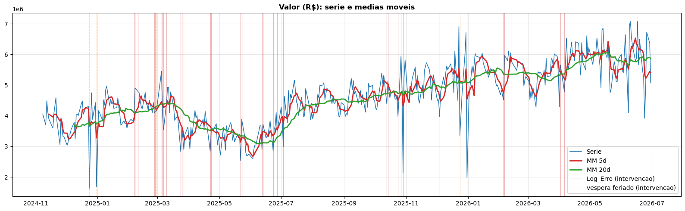
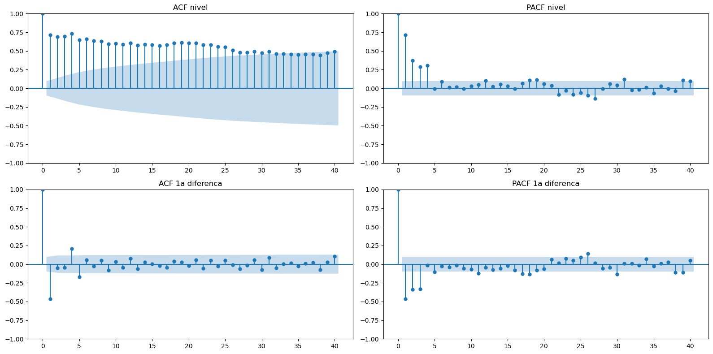
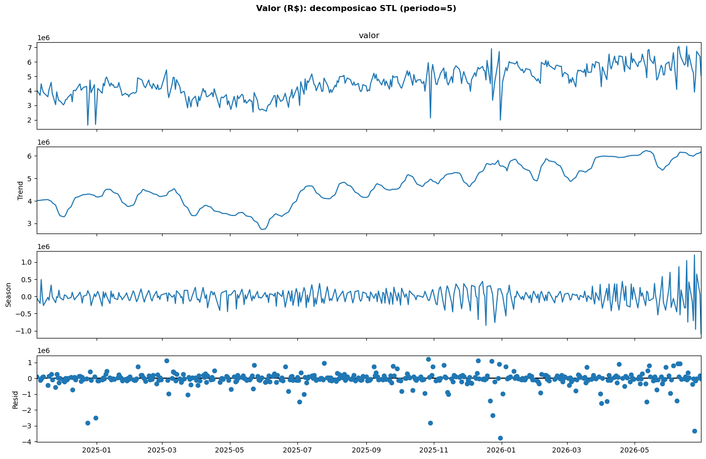
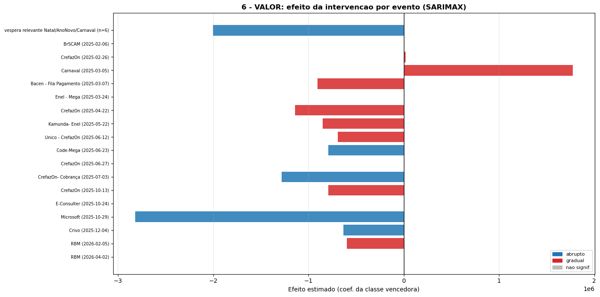
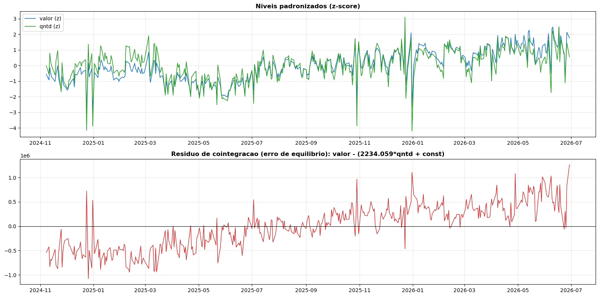
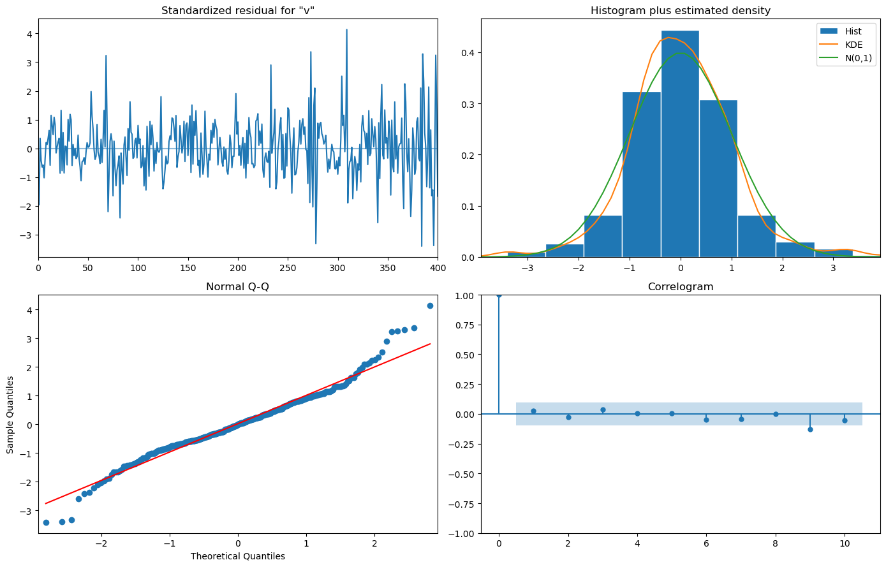
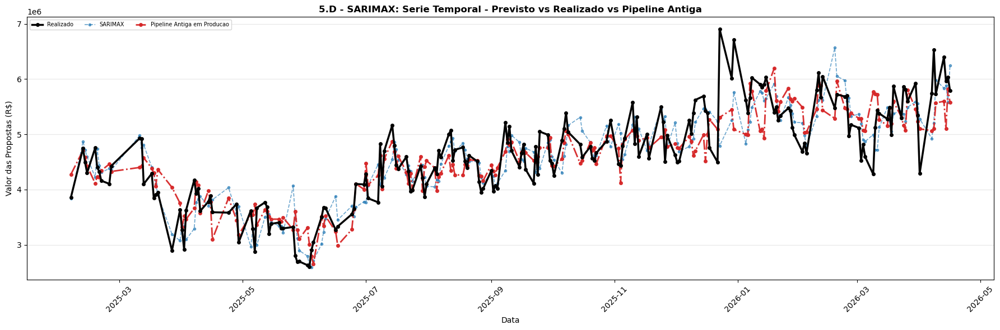
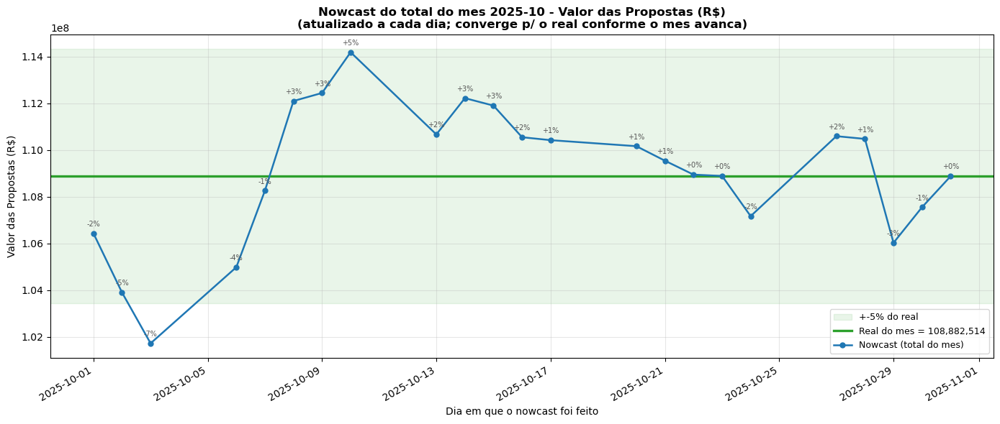

---
tags:
  - modelo
  - previsao
  - valor
  - sarima
  - sarimax
  - intervencao
  - apresentacao
created: 2026-07-01
author: Daniel Ramazzotte
disciplina: Econometria e Análise de Intervenção
---

<!-- _class: cover -->
<!-- _paginate: false -->

# Modelagem SARIMA/SARIMAX da série diária de Valor de Propostas

## Econometria e Análise de Intervenção

Séries temporais clássicas, análise de intervenção (Box–Tiao) e teste de cointegração
aplicados às séries diárias de **valor** e **quantidade** de propostas (etapa 16).

**Daniel Ramazzotte** · Julho/2026

---

## Agenda

1. **Motivação** — por que um modelo branco de séries temporais
2. **Metodologia** — variáveis, métodos e desenho de validação
3. **Estimação** — ordem, coeficientes e interpretação
4. **Análise de Intervenção** — dias atípicos (pulso × degrau)
5. **Cointegração** — valor × quantidade
6. **Adequação** — diagnóstico dos resíduos
7. **Capacidade preditiva** — ranking walk-forward e demais modelos
8. **Escolha do melhor modelo** e conclusões

---

<!-- _class: section-divider -->

## 1. Motivação

### Por que série temporal clássica, e não só AutoML?

---

## Motivação

O modelo em produção (**Pipeline TPOT / ML**) prevê bem, mas é uma **caixa-preta**: não diz
*o quanto* a fila pesa, nem *como* a série se comporta ao longo do tempo. Para uma leitura
econométrica, precisamos de um modelo **branco**.

- **Interpretabilidade.** Cada termo (média móvel, sazonalidade, efeito da fila, efeito dos
  dias de erro) vem com **coeficiente, erro-padrão e p-valor**.
- **Estrutura temporal explícita.** Tendência (diferenciação `d=1`), choque do dia anterior
  (MA), sazonalidade semanal (`m=5`) — o ML só capta isso de forma indireta via lags.
- **Tratamento transparente dos dias atípicos.** Em vez de simplesmente descartá-los, usamos
  um **modelo de intervenção** (Box–Tiao) que mede o efeito de cada evento.

> [!important] Meta
> Um *benchmark* clássico interpretável, competitivo com o melhor ML, que **explique** o que
> move a série de valor.

---

## As duas séries — Valor e Quantidade

Agregação **diária** das propostas da etapa 16, apenas **dias úteis** (exclui sábados,
domingos e feriados via `workadays`) → sazonalidade semanal regular `m = 5`.

- **Valor (R$):** valor monetário processado no dia — série-alvo principal.
- **Quantidade:** nº de propostas analisadas no dia — série de apoio (e candidata à
  cointegração com o valor).
- Histórico completo: **~409 dias úteis** (08/11/2024 → 23/06/2026).



---

<!-- _class: section-divider -->

## 2. Metodologia

### Variáveis, métodos e desenho de validação

---

## Variáveis do modelo

| Papel | Valor | Quantidade |
|-------|-------|------------|
| **Endógena** `y_t` | valor diário (R$) | quantidade diária |
| **Exógena D-1** | `fila_d1` — fila de pagamento de ontem (etapa 15) | `valor_d1` — valor de ontem |
| **Dummies calendário** | dia-da-semana (`ter…sex`; 2ª = referência) | idem |
| **Intervenção** | `pulso/degrau` dos dias especiais | idem |

- A **exógena é sempre de D-1** (conhecida no momento da previsão → sem vazamento).
- **Dummies de dia-da-semana** capturam o padrão semanal **pelo dia real**, não pela posição
  `t-5` na grade (que desalinha quando um feriado some da série).
- **Segunda-feira é a categoria de referência** (`drop_first`) para evitar colinearidade.

---

## Métodos — em uma frase cada

- **ARIMA(p,d,q).** Auto-regressivo + diferenciação + média móvel.
- **`d = 1`.** A série é **I(1)** (não-estacionária em nível, estacionária na 1ª diferença,
  confirmado por ADF/KPSS). Uma diferença remove a tendência/nível.
- **MA(1) — `ma.L1`.** Corrige a previsão pelo **choque (erro) do dia anterior** →
  suavização tipo média móvel exponencial.
- **SARIMA — sazonal `m=5`.** Termo `ma.S.L5` capta o resíduo do padrão semanal.
- **SARIMAX — o "X".** Acrescenta regressores exógenos (`fila_d1` + dummies).
- **Intervenção (Box–Tiao).** Dummies de **pulso** ou **degrau** para os dias atípicos.

---

## Análise clássica da série

Antes de estimar: **estacionariedade** (ADF/KPSS), **autocorrelação** (ACF/PACF) e
**decomposição** (STL, período 5).



- ACF em **nível decai lentamente** → não-estacionária → justifica `d=1`.
- Na **1ª diferença**, ACF com pico negativo no lag 1 → assinatura de **MA(1)**.

---

## Decomposição STL (período = 5)

Tendência suave de médio prazo + **sazonalidade semanal clara** + resíduo com *spikes* nos
dias atípicos (que a intervenção vai tratar).



---

## Seleção de ordem — `pmdarima.auto_arima`

Busca *stepwise* por **AIC**, sazonalidade `m = 5`, escolhida **uma vez** por série
(*fallback* fixo se a busca falhar).

| Série | Ordem selecionada | AIC (univariado) |
|-------|-------------------|:----------------:|
| **Valor** | `SARIMA(0,1,1)(0,0,1,5)` | 12.020,7 |
| **Quantidade** | `SARIMA(0,1,1)(0,0,2,5)` | 5.901,3 |

- `(0,1,1)`: 1 diferença (I(1)) + **MA(1)** para o choque do dia anterior.
- `(0,0,1,5)` / `(0,0,2,5)`: **MA sazonal** no lag 5 (semanal).
- Mesma especificação é reajustada em **todos os folds** do walk-forward.

---

## Validação — Walk-forward × ajuste "normal"

O ponto que torna a comparação **honesta**: replicar a operação real (retreina todo dia,
prevê o próximo).

| | **Walk-forward** | **Normal (1 ajuste)** |
|---|---|---|
| Nº de ajustes | **N** (um por dia) | 1 |
| Usa dados futuros p/ estimar? | **Não** (sem vazamento) | in-sample: sim; split: não |
| O que mede | **Erro out-of-sample realista** | qualidade de ajuste / 1 ponto |
| Custo | N× mais lento | barato |
| Onde no estudo | ranking e correção de viés | seções de diagnóstico |

> [!note]
> O MAPE/RMSPE do **ranking** vem do walk-forward 1-passo — comparável de igual para igual
> com a Pipeline Antiga (que no backup também é previsão diária de 1 passo).

---

## Dias removidos do ranking + correção de viés

**Dias atípicos** (`Log_Erro` e vésperas) são **retirados do `datas_eval`**: o ranking
pontua apenas **dias normais**, que são o alvo real.

- Nesses dias normais as colunas de intervenção valem **0** → a intervenção **não** prevê o
  dia do evento.
- O ganho é **indireto**: as dummies **descontaminam o ajuste** — os coeficientes AR/MA são
  estimados **limpos**, sem serem puxados pelos *spikes* → previsões melhores nos dias normais.

**Correção de viés (`aplica_debias`).** Sobre a sequência walk-forward, corrige a próxima
previsão pela **média dos erros passados** (janela 10 dias, `rolling + shift(1)` → sem
vazamento). Quase zera o viés ao custo de ~0,3 p.p. de RMSPE.

---

## Dummies de dia-da-semana — alinhamento

Adicionadas na exógena (`dow_ter…dow_sex`, 2ª = referência), então usadas por **SARIMAX** e
pelos ajustes de intervenção que recebem exógena.

- Capturam o padrão semanal pelo **dia real**, robusto à ausência de feriados na grade.
- Bônus: o efeito de cada intervenção passa a ser estimado **controlando o dia da semana**.
- **SARIMA puro permanece univariado** (`exog=None`, só `m=5`) **por design**: assim o
  ranking mostra diretamente **se as dummies ajudam** (SARIMA sem × SARIMAX com).

> [!note]
> No walk-forward a exógena é padronizada por z-score (reparametrização linear, previsão
> idêntica). Com `MIN_TREINO≈25` (~5 semanas) todos os dias-da-semana aparecem em qualquer
> janela → sem matriz singular.

---

<!-- _class: section-divider -->

## 3. Estimação

### Coeficientes e interpretação (SARIMAX — Valor)

---

## Coeficientes do SARIMAX — Valor

Ajuste in-sample no histórico completo, `fila_d1` padronizada (z-score) + dummy de pulso:

```
              SARIMAX(0,1,1)x(0,0,1,5)  —  N=404  —  AIC = 11.631
================================================================================
              coef        std err     z      P>|z|    interpretação
--------------------------------------------------------------------------------
fila_d1_z   +1,027e+05   2,34e+04   +4,38   0,000   efeito da fila D-1 (padronizada)
pulso_erro  -4,545e+05   9,30e+04   -4,89   0,000   efeito dos dias de erro
ma.L1          -0,7829     0,034   -22,87   0,000   choque MA(1) não-sazonal
ma.S.L5        -0,0862     0,046    -1,87   0,062   sazonal semanal (limítrofe)
================================================================================
```

- **`fila_d1` (+R$102,7 mil/desvio, p<0,001):** +1 dp de fila (~54 propostas) → **~R$102,7 mil**
  a mais no valor do dia (~R$1,9 mil por proposta a mais na fila). Fila é *driver* antecedente.
- **`pulso_erro` (−R$454,5 mil, p<0,001):** dias de erro derrubam o valor ~**10%** da média
  diária → valida tratá-los como **intervenção**, não ruído.
- **`ma.L1` (−0,78):** principal mecanismo preditivo — corrige o nível por **78% do choque de ontem**.
- **`ma.S.L5` (−0,086, p≈0,06):** resíduo semanal fraco (a maior parte já foi absorvida).

---

## AIC — os regressores ajudam?

| Especificação | AIC |
|---------------|:---:|
| SARIMA univariado (sem exógena/intervenção) | 11.640 |
| **SARIMAX** (`fila_d1` + `pulso_erro`) | **11.631** |

Os dois regressores **reduzem o AIC** e ambos são **altamente significativos (p < 0,001)** —
evidência de que a fila D-1 e a intervenção agregam informação genuína, não só grau de
liberdade.

---

<!-- _class: section-divider -->

## 4. Análise de Intervenção

### Dias atípicos: pulso × degrau (Box–Tiao)

---

## Modelo de intervenção — pulso × degrau

Para cada **dia especial** (eventos do `Log_Erro` operacional + vésperas de feriado)
ajustamos SARIMA/SARIMAX com **regressores de intervenção** e classificamos o efeito:

- **Pulso (impulso):** efeito **transitório**, restrito ao(s) dia(s) do evento
  (dummy = 1 no evento, 0 nos demais). Típico de **paradas operacionais**.
- **Degrau (step):** **mudança de nível permanente** a partir do evento
  (dummy = 0 antes, 1 do evento em diante). Típico de **mudanças estruturais**.

**Escolha:** por evento ajustamos os dois modelos e ficamos com o de coeficiente
**significativo (p < 0,05)** e menor **AIC**. Aqui a série **mantém** os dias especiais —
é necessário para estimar o efeito.

---

## Efeito estimado por evento — Valor

18 eventos classificados. Predominam efeitos **negativos** (paradas/erros derrubam o valor);
Carnaval aparece como **positivo** (acúmulo pós-feriado).



---

## A intervenção limpa o ajuste — resíduo pré × pós

Comparando o SARIMA **sem** e **com** as dummies de intervenção (valor, N=409):

| Modelo | AIC | BIC | DP resíduo | MAE resíduo | LB p(10) | LB p(20) |
|--------|:---:|:---:|:----------:|:-----------:|:--------:|:--------:|
| PRÉ (sem intervenção) | 5.728 | 5.744 | 359,4 | 246,6 | **0,01** | 0,00 |
| **PÓS (com intervenção)** | **5.641** | **5.669** | **327,2** | **230,9** | **0,36** | 0,18 |

- **AIC cai** (5.728 → 5.641), **desvio do resíduo cai** (359 → 327).
- **Ljung-Box deixa de rejeitar** (p 0,01 → 0,36): a autocorrelação residual que os *spikes*
  causavam **desaparece** → dinâmica de curto prazo bem capturada.

---

## Honestidade metodológica

> [!important] A sutileza
> A intervenção entra no ranking como **descontaminação do ajuste**, não como predição do
> dia do evento. Nos dias avaliados (normais) as dummies valem 0; o benefício é que os
> parâmetros AR/MA saem estimados sem serem puxados pelos *spikes* passados.

**Um look-ahead pequeno e estrutural:** a **classificação da forma** (abrupto × gradual) é
calculada **uma vez na série inteira**; já os **coeficientes** são reestimados a cada dia no
walk-forward (`iloc[:loc]`, só o passado). A maior parte da informação é **calendário**
(vésperas e dias de log são conhecidos de antemão), então reclassificar dentro do
walk-forward custaria caro e mudaria pouco.

---

<!-- _class: section-divider -->

## 5. Cointegração — Valor × Quantidade

### Existe equilíbrio de longo prazo entre as duas séries?

---

## Cointegração — a pergunta e o pré-requisito

Cointegração testa-se nos **níveis**, não nas diferenças. O pré-requisito é que ambas sejam
**I(1)** — o que a diferenciação já confirmou.

- **Ambas I(1):** ADF em nível não rejeita raiz unitária (valor p=0,86; qtd p=0,54); na 1ª
  diferença p=0,00.
- **Interpretação econômica:** se cointegradas com vetor `(1, −β)`, o **ticket médio**
  (`valor/qtd`) seria estacionário → proporcionalidade estável.
- **Testes:** Engle-Granger e Johansen sobre os níveis; ADF do ticket médio.

---

## Resultado — não há cointegração confiável

| Teste | Estatística | Resultado |
|-------|-------------|-----------|
| **Engle-Granger** | p = 0,96 | **NÃO rejeita** H0 → sem cointegração |
| Johansen (traço, sem tendência) | 1 relação | ambíguo |
| Johansen (com tendência) | 2 relações | vs. ADF-`ct` indica **trend-stationary** |
| **ADF do ticket médio** | p = 0,86 | erro de equilíbrio **não-estacionário** |



> [!warning] Conclusão
> O erro de equilíbrio **deriva** (não volta à média) → **modelar as séries separadamente**.
> Como as ordens ficam mistas I(0)/I(1) para a qtd, o *follow-up* correto seria o **teste de
> limites ARDL** (Pesaran-Shin-Smith), não VECM.

---

<!-- _class: section-divider -->

## 6. Adequação

### Diagnóstico do ajuste (resíduos)

---

## Diagnóstico dos resíduos — SARIMAX Valor



- **Autocorrelação:** correlograma dentro das bandas; Ljung-Box **não rejeita** (Prob(Q)≈0,67)
  → **curto prazo bem modelado**.
- **Ressalvas:** **heterocedasticidade** (Prob(H)≈0,00) e **caudas pesadas/assimetria**
  (Jarque-Bera signif., curtose≈8,5) — erros maiores em dias atípicos.
- Matriz de covariância quase singular (`σ²` grande) → ler os **erros-padrão de σ² com
  cautela**; a significância de `fila_d1`/`pulso_erro` (z≈4–5) é robusta.

Isso **justifica** a intervenção (trata os *spikes*) e a **correção de viés** por cima.

---

<!-- _class: section-divider -->

## 7. Capacidade preditiva

### Ranking walk-forward 1-passo

---

## Ranking — Valor (N = 210, ordenado por RMSPE)

| Modelo | MAPE % | RMSPE % | R² | \|Viés\| (R$) | Mediana % |
|--------|:------:|:-------:|:--:|:-------------:|:---------:|
| **SARIMAX** | 7,34 | **9,22** | **0,75** | 11.924 | 6,15 |
| Pipeline Antiga em Produção | **7,21** | 9,55 | 0,74 | 28.974 | 5,32 |
| SARIMA (univariado) | 7,57 | 9,55 | 0,75 | 25.049 | 6,45 |
| SARIMAX (corrigido) | 7,61 | 9,73 | 0,73 | 5.631 | 6,25 |
| SARIMA (corrigido) | 7,89 | 10,03 | 0,72 | 3.941 | 6,56 |

- **SARIMAX tem o melhor RMSPE e o melhor R²** entre todos os candidatos.
- Fica ~0,1 p.p. atrás da Antiga só no **MAPE médio** — mas a Antiga é **retreinada quase
  diariamente**; o SARIMAX usa uma única especificação.

---

## Valor — previsto × realizado (SARIMAX)



O SARIMAX acompanha bem o nível e a sazonalidade; os maiores erros concentram-se nos
*saltos* pós-atípicos (justamente onde a Antiga também erra).

---

## Ranking — Quantidade (N = 262)

| Modelo | MAPE % | RMSPE % | R² | Mediana % |
|--------|:------:|:-------:|:--:|:---------:|
| **SARIMA (univariado)** | **7,38** | **9,22** | **0,47** | 6,50 |
| SARIMA (corrigido) | 7,69 | 9,73 | 0,41 | 6,32 |
| SARIMAX | 7,64 | 10,01 | 0,38 | 6,01 |
| Pipeline Antiga em Produção | 8,01 | 10,23 | 0,36 | 6,38 |
| SARIMAX (corrigido) | 8,07 | 10,54 | 0,31 | 6,42 |

> [!warning] Contraste importante
> Para a **quantidade**, o **SARIMA univariado vence** — a exógena `valor_d1` **não ajuda**
> (piora RMSPE). O padrão semanal `m=5` já basta. Confirma o valor de deixar SARIMA e SARIMAX
> lado a lado no ranking.

---

## Outros modelos testados

| Modelo | O que é | Resultado |
|--------|---------|-----------|
| **ARDL (bounds test)** | Relação de longo prazo com ordens mistas I(0)/I(1) | *follow-up* da cointegração; não superou o SARIMAX |
| **Log-retorno** | Modela `r_t = ln(y_t/y_{t-1})`, estabiliza variância | competitivo, mas atrás do SARIMAX |
| **Nowcast mensal** | Realizado acumulado + previsão dos dias restantes | converge para o total real ao longo do mês |
| **SARIMAX mensal** | Uma previsão do total do mês antes de ele começar | linha de referência |



---

<!-- _class: section-divider -->

## 8. Escolha do melhor modelo

---

## Recomendação

> [!success] Valor → SARIMAX `(0,1,1)(0,0,1,5)` + `fila_d1` + `pulso_erro`
> Melhor **RMSPE (9,22%)** e **R² (0,75)** do estudo; MAPE (7,34%) praticamente empatado com
> a Pipeline Antiga, com a vantagem decisiva de ser **interpretável**.

> [!success] Quantidade → SARIMA univariado `(0,1,1)(0,0,2,5)`
> A exógena não ajuda; o modelo univariado com sazonalidade semanal é o melhor e o mais
> parcimonioso (MAPE 7,38%, RMSPE 9,22%).

**O SARIMAX de valor mostra, com significância estatística, que:**
1. a **fila do dia anterior** é *driver* positivo e forte (+R$1,9 mil/proposta);
2. os **dias de erro operacional** derrubam o valor em ~10% e merecem intervenção;
3. a dinâmica diária é bem descrita por **suavização MA(1)** com leve componente semanal.

---

## Conclusões, limitações e próximos passos

**Conclusões**
- Modelo **branco** competitivo com o melhor ML e **superior no RMSPE** para valor.
- A **análise de intervenção** melhora o ajuste (AIC↓, Ljung-Box deixa de rejeitar).
- **Sem cointegração** valor × qtd → séries modeladas separadamente.

**Limitações**
- Heterocedasticidade e caudas pesadas nos resíduos (mitigadas por intervenção + debias).
- Classificação da forma da intervenção com pequeno look-ahead estrutural (calendário).
- Não substitui a Pipeline Antiga em produção (retreinada quase diariamente).

**Próximos passos**
- Injetar intervenções (Carnaval/vésperas) como exógena futura determinística no nowcast.
- Avaliar reclassificação da intervenção dentro do walk-forward (rigor total).

---

## Referências

- Notebook do experimento: [[experimento_sarimax]]
- Justificativa detalhada: `docs/justificativa_sarimax_valor.md`
- Scripts de produção: `scripts/producao/projecoes_valor.py`, `projecoes_qtd.py`
- Backups de previsão: `resultados/backup_valor.xlsx`, `backup_qtd.xlsx`
