<!-- _class: cover -->
<!-- _paginate: false -->

# Modelagem SARIMA/SARIMAX das séries diárias de Valor **e** Quantidade de Propostas

## Econometria e Análise de Intervenção

Séries temporais clássicas, análise de intervenção (Box–Tiao) e teste de cointegração
aplicados **em pé de igualdade** às séries diárias de **valor (R$)** e **quantidade** de
propostas (etapa 16).

**Daniel Ramazzotte** · Julho/2026

---

## Agenda

**Introdução** — motivação, dados e construção da base

**Bloco 1 — Cointegração** (valor × quantidade têm equilíbrio de longo prazo?) → método + resultado

**Bloco 2 — Análise de intervenção** (Box–Tiao) → método + resultado

**Bloco 3 — Estimação e Validação** (SARIMA/SARIMAX, walk-forward, ranking) → método + resultado

**Bloco 4 — Modelos mensais** → método + resultado

**Fechamento** — Interpretação · Conclusão · Discussão

---

<!-- _class: section-divider -->

## Introdução

### Motivação, dados e construção da base

---

## Por que prever vendas diárias? (necessidade de negócio)

A área de crédito precisa saber, **todo dia útil**, o que esperar do dia seguinte em duas
frentes operacionais distintas:

- **Quantidade** — quantas propostas chegarão para análise hoje? Dimensiona a **equipe/fila
  de análise** (capacidade de atendimento, alocação de analistas).
- **Valor (R$)** — quanto será processado em propostas hoje? Dimensiona **capital, caixa e
  risco** (quanto a operação precisa ter disponível).

Essas duas perguntas já são respondidas **hoje em produção**, por um sistema automatizado que
vamos chamar, ao longo desta apresentação, de **"Pipeline em Produção"** (ou "Pipeline Antiga
em Produção" quando comparado aos modelos novos deste estudo) — é a referência que qualquer
modelo novo precisa **igualar ou superar** para ser adotado.

> **O modelo atual, em uma frase:** um pipeline de **AutoML (TPOT)** — busca automatizada
> entre milhares de combinações de features/algoritmos de ML, **retreinado quase
> diariamente** para se manter competitivo. Potente, mas **caixa-preta**: não dá para ler,
> a partir dele, "quanto a fila pesa" ou "quanto um erro operacional custa" na previsão.

---

## Motivação

- **Pergunta do estudo:** um modelo econométrico **clássico** (SARIMA/SARIMAX), com
  estrutura interpretável e **uma única especificação fixa** (não retreinada a cada dia),
  consegue **igualar ou superar** a Pipeline em Produção nas duas séries que ela já prevê?
- **Se sim, o que se ganha:** coeficientes com significância estatística (o que empurra a
  série pra cima/baixo, e por quanto), tratamento **transparente** dos dias atípicos
  (intervenção de Box–Tiao em vez de simplesmente descartá-los) e um modelo auditável.
- **Escopo:** valor e quantidade tratados **em pé de igualdade** — as duas passam pelo
  mesmo pipeline metodológico (cointegração → intervenção → walk-forward → ranking).

> **Se o modelo branco vencer ou empatar:** ganha-se interpretabilidade sem abrir mão de
> acurácia. Se perder: ao menos serve como *benchmark* diagnóstico do que move a série.

---

## Construção da base

Agregação **diária** das propostas da etapa 16, apenas em **dias úteis** (exclui sábados,
domingos e feriados nacionais via `workadays`) → sazonalidade semanal regular **`m = 5`**.

| | **Valor (R$)** | **Quantidade** |
|---|---|---|
| Definição | valor monetário processado no dia | nº de propostas analisadas no dia |
| Fonte | `crefaz.ft_proposta` (etapa 16) | `crefaz.ft_proposta` (etapa 16) |
| Papel | série-alvo | série-alvo |

- **As duas séries têm o mesmo status:** cada uma recebe seleção de ordem, intervenção,
  ranking e modelo recomendado próprios.
- Histórico: **~410 dias úteis** (07/11/2024 → 01/07/2026).
- Janela de avaliação walk-forward: **N = 209** (valor) e **N = 211** (quantidade).

---

## As duas séries lado a lado

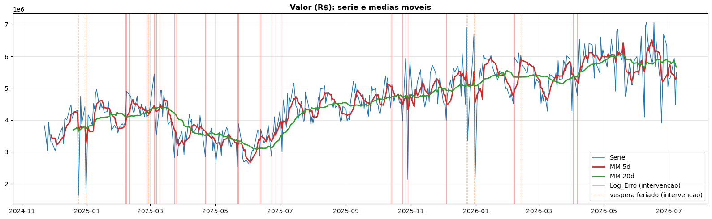
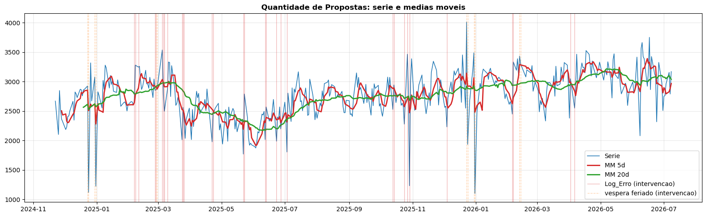

Séries com médias móveis de 5 e 20 dias; linhas verticais = dias de intervenção. Ambas
mostram **nível que passeia** (não-estacionário), **sazonalidade semanal** e **quedas
pontuais** nos dias de erro operacional.

---

## Análise clássica — estacionariedade e ACF/PACF

Antes de estimar: **estacionariedade** (ADF/KPSS), **autocorrelação** (ACF/PACF) e
**decomposição** (STL, período 5) — feitas para **as duas séries**.

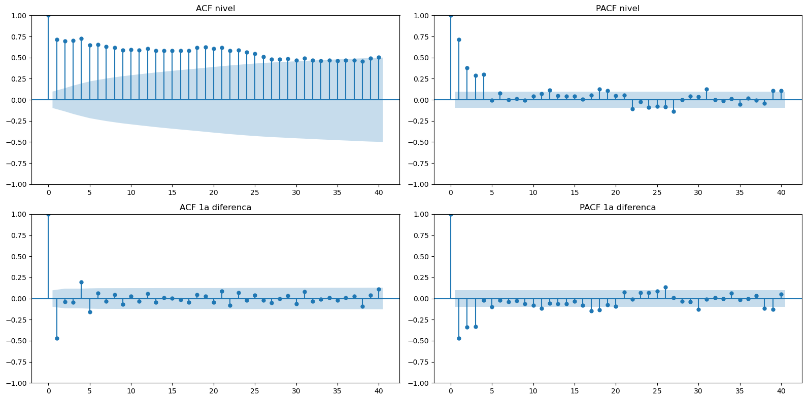

- ACF em **nível decai lentamente** (valor e qtd) → não-estacionária → justifica `d = 1`.
- Na **1ª diferença**, pico negativo no lag 1 → assinatura de **MA(1)** em ambas.

---

## Decomposição STL (período = 5)

Tendência suave de médio prazo + **sazonalidade semanal clara** + resíduo com *spikes* nos
dias atípicos (que a intervenção trata). Padrão **idêntico** nas duas séries (quantidade tem
histórico mais curto: dado começa em mai/2025, vs nov/2024 do valor).

---

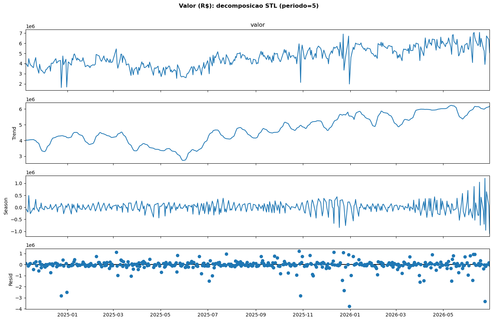

---

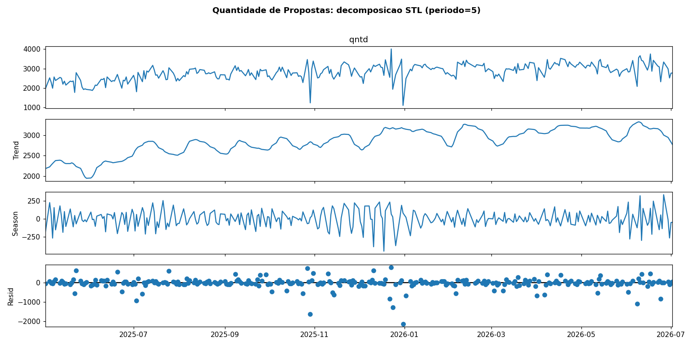

---

<!-- _class: section-divider -->

## Bloco 1 — Cointegração

### Valor e quantidade têm equilíbrio de longo prazo?

---

## Cointegração — o método

Cointegração testa-se nos **níveis**, não nas diferenças. O pré-requisito é que ambas as
séries sejam **I(1)** (não-estacionárias em nível, estacionárias na 1ª diferença).

- **Pergunta econômica:** se valor e quantidade forem cointegrados com vetor `(1, −β)`, o
  **ticket médio** (`valor / qtd`) seria estacionário → proporcionalidade estável no longo prazo.
- **Testes aplicados:** Engle–Granger e Johansen (traço) sobre os níveis; seleção do lag do VAR
  por critério de informação antes do Johansen (sensível ao lag); ADF do ticket médio; ADF com
  tendência (`ct`) para descartar *trend-stationarity*.
- **Ajuste de intervenção (pré-teste):** antes de qualquer teste, remove-se dos níveis o efeito
  de **pulso** dos dias atípicos (`Log_Erro` + véspera Natal/Ano Novo/Carnaval) — outlier aditivo
  via regressão em `[const, dummy_atípico]`, subtraindo o coeficiente do dummy (preserva
  nível/tendência, só tira o choque pontual). Necessário porque o Johansen desta versão do
  `statsmodels` não aceita exógena — sem isso, os choques pontuais (fora do equilíbrio de longo
  prazo) inflam ou mascaram Engle–Granger e Johansen.

> **Por que importa:** decide se as duas séries devem ser modeladas **juntas** (VECM/ARDL)
> ou **separadamente**. É o teste que legitima tratar valor e quantidade como problemas
> independentes.

---

## Resultado — Cointegração (não há cointegração confiável)

**Ajuste prévio:** 37 dias atípicos (`Log_Erro` + véspera Natal/Ano Novo/Carnaval) tiveram o
efeito de pulso removido dos níveis antes dos testes (outlier aditivo, coeficiente único
para os 37 dias — nível/tendência preservados).

| Teste | Valor | Quantidade | Leitura |
|---|---|---|---|
| ADF nível | p = 0,060 | p = **0,0005** | valor **I(1)** · qtd **I(0)** — ordens **mistas** |
| ADF 1ª diferença | p = 0,000 | p = 0,000 | ambas estacionárias diferenciadas |
| ADF-`ct` (com tendência) | p = 0,0004 | p = 0,0003 | ambas **trend-stationary** |
| **Engle–Granger** (estat = −0,60) | p = **0,956** | | **NÃO rejeita** → sem cointegração |
| ADF do ticket médio | p = 0,790 | | erro de equilíbrio **não-estacionário** |

Relação de longo prazo estimada: `valor = −1.536.713 + 2.220,46 · qtd` (β ≈ ticket médio).

- **Seleção de lag do VAR:** AIC → 12, BIC → 4 (usa-se `k_ar_diff = 11` no Johansen); teste de
  whiteness dos resíduos não pôde ser calculado (nlags insuficiente para 12 lags no modelo).
- **Johansen (sem tendência):** traço 13,83 (r≤0, crit5%=15,49) e 0,38 (r≤1, crit5%=3,84) →
  **0 relações**. **Com tendência determinística:** traço 27,49 e 8,53 (crit5%=18,40/3,84) →
  **2 relações**, mas coincide com a *trend-stationarity* do ADF-`ct` — não cointegração genuína.

> **Conclusão:** o erro de equilíbrio **deriva** (não volta à média) → **modelar as séries
> separadamente**. Como as ordens ficam mistas I(0)/I(1), o *follow-up* correto é o **teste de
> limites ARDL** (Pesaran–Shin–Smith), não VECM.

---

## Resultado — Cointegração: gráficos

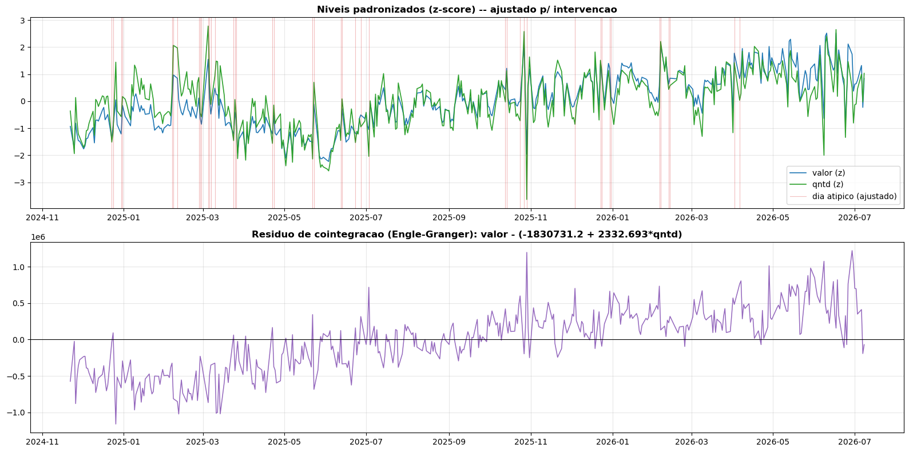

Painel superior: valor e quantidade em z-score, com os dias atípicos ajustados marcados em
vermelho. Painel inferior: resíduo de Engle-Granger (`valor − relação de longo prazo`) —
**deriva** ao longo do tempo em vez de oscilar em torno de zero, evidência visual da ausência
de cointegração.

---

<!-- _class: section-divider -->

## Bloco 2 — Análise de intervenção

### Como os dias atípicos (erro operacional e feriados) são tratados

---

## Intervenção — o método (Box–Tiao)

Para cada **dia especial** (eventos do `Log_Erro` operacional + vésperas de feriado) ajustamos
o SARIMA/SARIMAX com **regressores de intervenção** e testamos até 3 formas de efeito
(temporário — nenhuma delas é uma mudança de nível permanente):

- **Abrupto:** efeito **constante** durante os dias de impacto, some abruptamente depois.
  Única forma testável em eventos de **1 dia**.
- **Gradual:** efeito **máximo no 1º dia**, decaindo linearmente até o fim da janela.
  Só testado para janelas com **mais de 1 dia**.
- **Rebote (bifásico):** **1º dia** com efeito de sinal **oposto** ao(s) dia(s) seguinte(s)
  (ex.: erro derruba no dia 1, backlog processado no dia 2 empurra acima da média). Só
  testado para `Log_Erro` com janela contígua **≥ 2 dias**.

**Escolha por evento:** ajustam-se as formas aplicáveis e fica-se com a de coeficiente(s)
**significativo(s) (p < 0,05)** e menor **AIC**; empate → abrupto. Aqui a série **mantém**
os dias especiais — é necessário para estimar o efeito.

> **Papel no ranking:** a intervenção **descontamina o ajuste** — os coeficientes AR/MA são
> estimados sem serem puxados pelos *spikes*. Nos dias avaliados (normais) as dummies valem 0.

---

## Intervenção — funções de transferência

**Abrupto** (efeito constante, retorno abrupto a 0):

$$\text{efeito}(t) = \omega_0 \cdot I(t), \qquad I(t) = \begin{cases} 1 & \text{dias de impacto} \\ 0 & \text{fora} \end{cases}$$

**Gradual** (decaimento linear ao longo da janela de impacto, posição 0-indexada):

$$w(k) = \frac{n-k}{n}, \qquad k=0 \Rightarrow w=1, \qquad k=n-1 \Rightarrow w=\frac{1}{n}$$

**Rebote / bifásico** (2 regressores livres, coeficientes independentes):

$$\text{efeito}(t) = \beta_1 \cdot \text{rebote\_dia1}(t) + \beta_2 \cdot \text{rebote\_pos}(t)$$

Só aceito como classe se **β₁ e β₂ forem significativos E de sinais opostos**
($\text{sign}(\beta_1) \neq \text{sign}(\beta_2)$) — captura o padrão "queda no dia 1,
recuperação acima da média depois".

---

## Log_Erro — registro completo (`logs/Log_Erro.xlsx`)

Base de incidentes operacionais que alimenta a análise de intervenção (17 eventos; a véspera
de Natal/Ano Novo/Carnaval entra à parte, via calendário):

| Data | Sistema em erro | Impacto (dias úteis) |
|---|---|:---:|
| 06/02/2025 | BrSCAM | 3 |
| 26/02/2025 | CrefazOn | 2 |
| 05/03/2025 | Carnaval | 2 |
| 07/03/2025 | Bacen - Fila Pagamento | 2 |
| 24/03/2025 | Enel - Mega | 3 |
| 22/04/2025 | CrefazOn | 2 |
| 22/05/2025 | Kamunda - Enel | 2 |
| 12/06/2025 | Unico - CrefazOn | 2 |
| 23/06/2025 | Code-Mega | 1 |
| 27/06/2025 | CrefazOn | 1 |
| 03/07/2025 | CrefazOn - Cobrança | 1 |
| 13/10/2025 | CrefazOn | 2 |
| 24/10/2025 | E-Consulter | 2 |
| 29/10/2025 | Microsoft | 1 |
| 04/12/2025 | Crivo | 1 |
| 05/02/2026 | RBM | 2 |
| 02/04/2026 | RBM | 2 |

`Impacto/dias` define a janela de dias úteis afetados a partir da `Data` — é o `n` usado nas
fórmulas de gradual/rebote da forma anterior.

---

## Resultado — Intervenção: efeito por evento

**18 eventos** classificados em cada série (abrupto × gradual × rebote). Predominam efeitos
**negativos** (paradas/erros derrubam a série); **Carnaval** aparece como **positivo**
(acúmulo pós-feriado).

| Evento (exemplos) | Efeito no **Valor** | Efeito na **Quantidade** |
|---|---|---|
| Véspera Natal/Ano-Novo/Carnaval | −R$ 2,00 mi (abrupto) | −922 (abrupto) |
| Microsoft (29/10/2025) | −R$ 2,82 mi (abrupto) | −1.413 (abrupto) |
| CrefazOn-Cobrança (03/07/2025) | −R$ 1,28 mi (abrupto) | −705 (abrupto) |
| Carnaval (05/03/2025) | +R$ 1,77 mi (gradual) | +763 (abrupto) |
| Kamunda-Enel (22/05/2025) | queda dia 1 + recuperação dia 2 (**rebote**) | — |

Classificação: **Valor** → maioria gradual/abrupto, com a forma **rebote** também presente
(ex.: Kamunda-Enel) · **Quantidade** → maioria abrupto/não signif. Contagem exata por forma a
ser confirmada na próxima reexecução do notebook (ver Discussão).

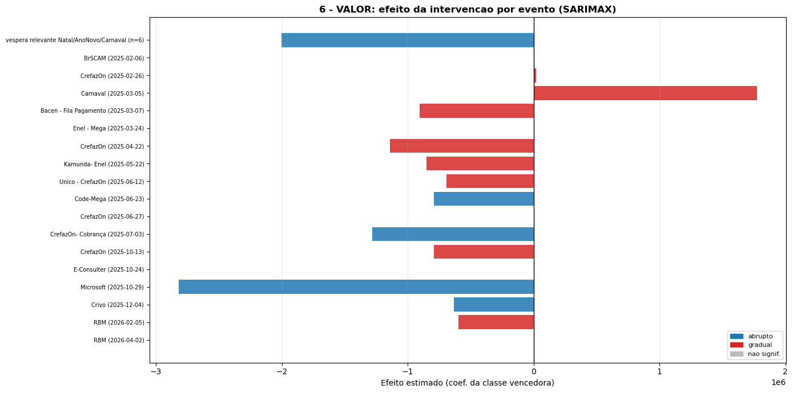

---

## Resultado — a intervenção limpa o ajuste (pré × pós)

Comparando o SARIMA **sem** e **com** as dummies de intervenção (N = 410):

| Série | | AIC | DP resíduo | MAE resíduo | Ljung-Box p(10) |
|---|---|:---:|:---:|:---:|:---:|
| **Valor** | pré | 11.831,6 | R$ 620,0 k | R$ 434,2 k | **0,02** ❌ |
| | **pós** | **11.745,9** | **R$ 550,5 k** | **R$ 395,3 k** | **0,40** ✅ |
| **Quantidade** | pré | 5.742,2 | 359,1 | 246,4 | **0,01** ❌ |
| | **pós** | **5.654,3** | **326,9** | **230,7** | **0,38** ✅ |

- **AIC e desvio do resíduo caem** nas duas séries.
- **Ljung-Box deixa de rejeitar** (p sobe de ~0,01 para ~0,4): a autocorrelação residual que os
  *spikes* causavam **desaparece** → dinâmica de curto prazo bem capturada.

---

<!-- _class: section-divider -->

## Bloco 3 — Estimação e Validação

### SARIMA/SARIMAX, walk-forward e ranking

---

## Método experimental — walk-forward × ajuste normal

Replica a operação real: **retreina todo dia, prevê o próximo**. Aplicado igualmente às duas séries.

| | **Walk-forward** | **Normal (1 ajuste)** |
|---|---|---|
| Nº de ajustes | **N** (um por dia) | 1 |
| Usa dados futuros p/ estimar? | **Não** (sem vazamento) | in-sample: sim |
| O que mede | **Erro out-of-sample realista** | qualidade de ajuste |
| Onde no estudo | ranking | diagnóstico |

- **Dias atípicos** (`Log_Erro` + vésperas) saem do `datas_eval`: o ranking pontua só **dias normais**.
- Comparação **maçã-com-maçã** com a **Pipeline Antiga** (backup), também previsão diária de 1 passo.
- **Respeita a ordem temporal:** a cada dia da janela de avaliação, o treino usa só dados
  **anteriores** (`y_tr = serie.iloc[:loc]`), prevê 1 passo à frente e anda um dia — nunca vê
  o futuro.

> **Vazamento leve — e só na especificação, não na estimação:** a ordem `(p,d,q)(P,D,Q)` é
> escolhida **uma única vez** via `auto_arima` sobre a **série inteira**, antes do
> walk-forward — viés otimista pequeno, porque essa escolha "viu" dados que, em cada dia do
> walk-forward, ainda estariam no futuro. Os **coeficientes**, porém, são reestimados
> honestamente a cada dia, só com o passado — a estimação em si (MLE via filtro de Kalman,
> em cada refit) não vaza. Tolerável porque a ordem é um objeto de baixa dimensão e estável (raramente muda
> entre 80% e 100% da série); rigor total exigiria congelar a ordem na janela inicial de
> treino ou reselecioná-la a cada dia (caro).

---

## Métricas de comparação

O ranking é ordenado por **RMSPE** (penaliza erros grandes); as demais métricas dão o retrato completo.

| Métrica | O que mede |
|---|---|
| **MAPE médio %** | erro percentual absoluto médio (dia típico) |
| **RMSPE %** | raiz do erro quadrático percentual — **chave do ranking** (pune outliers) |
| **R²** | fração da variância explicada |
| **Viés (MPE)** | erro médio com sinal → super/subestimação sistemática |
| **DP Erro** | desvio-padrão do erro — dispersão/consistência da previsão, independente do viés |
| **Mediana %** | robusta a caudas |
| **% < 5% / < 10%** | acurácia operacional (dias dentro da meta) |

> **Meta de qualidade:** MAPE ≤ 5% (ideal) · ≤ 10% (aceitável), idêntica para valor e quantidade.

---

## Covariáveis

A exógena é sempre de **D-1** (conhecida no momento da previsão → **sem vazamento**).

| Papel | **Valor** | **Quantidade** |
|---|---|---|
| Endógena `y_t` | valor diário (R$) | quantidade diária |
| **Exógena D-1** (só SARIMAX) | `fila_d1` — fila de pagamento de ontem (etapa 15) + dow (`ter…sex`) | `valor_d1` — valor de ontem + dow (`ter…sex`) |
| **Intervenção** (SARIMA + SARIMAX + Log-retorno) | abrupto/gradual/rebote dos dias especiais | idem |

- **Dummies de dia-da-semana** vêm empacotadas na MESMA exógena D-1 (só entram no **SARIMAX**)
  e capturam o padrão semanal pelo **dia real**, robusto à ausência de feriados na grade (que
  desalinharia o lag `t-5`).
- **SARIMA puro permanece univariado** por design (`exog=None`) → o ranking mostra
  **diretamente se a exógena ajuda** (SARIMA sem × SARIMAX com). *Spoiler:* ajuda no valor,
  não na quantidade. A **intervenção**, porém, entra nos **3 modelos** — não é exclusiva do
  SARIMAX.

---

## Modelos de séries temporais testados

Três famílias candidatas, **todas recebem os regressores de intervenção** (Box–Tiao) e são
avaliadas no **mesmo walk-forward** — a diferença entre elas é só a estrutura do modelo:

| Modelo | Endógena | Exógena D-1 (além da intervenção) | Intervenção | Ideia central |
|---|---|---|:---:|---|
| **SARIMA** | nível (`y_t`) | nenhuma (univariado) | ✅ | AR/MA + sazonalidade semanal (`m=5`) |
| **SARIMAX** | nível (`y_t`) | `fila_d1` / `valor_d1` | ✅ | SARIMA + regressor exógeno defasado |
| **Log-retorno** | `log(y_t) − log(y_{t-1})` | nenhuma | ✅ | modela a variação percentual diária, não o nível; a previsão é revertida (`exp`) de volta pro nível ao final |

- **A intervenção (dummies abrupto/gradual/rebote) entra nos 3 modelos**, não só no SARIMAX —
  é o que descontamina o ajuste dos *spikes* em qualquer um deles.
- **Só o SARIMAX recebe a covariável de negócio** (`fila_d1`/`valor_d1`) — é essa a única
  diferença estrutural entre SARIMA e SARIMAX no ranking.

> **Por que Log-retorno entra na disputa:** séries em nível têm variância que cresce com a
> escala; o log-retorno estabiliza a variância e é a parametrização clássica para retornos
> financeiros — vale testar se essa transformação ajuda aqui também.

---

## Resultado — Estimação (coeficientes verificados)

Ajuste in-sample no histórico completo (N = 410), exógena padronizada (z-score):

| Coeficiente | **Valor** `SARIMAX(0,1,1)(0,0,1,5)` | **Quantidade** `SARIMAX(0,1,1)(0,0,2,5)` |
|---|---|---|
| **Exógena D-1** | `fila_d1` **+96,8 mil / dp** · p < 0,001 ✅ | `valor_d1` **−14,4** · p = 0,61 ❌ |
| `ma.L1` (choque de ontem) | −0,784 · p < 0,001 | −0,794 · p < 0,001 |
| `ma.S.L5` (semanal) | −0,111 · p = 0,019 | −0,128 · p = 0,009 |
| `ma.S.L10` | — | −0,087 · p = 0,131 |
| AIC (com exógena) | 11.827,5 | 5.744,6 |

> **O achado central, com significância estatística:** a **fila do dia anterior** é *driver*
> **forte e positivo** do valor (p < 0,001), mas o **valor de ontem NÃO ajuda** a prever a
> quantidade (p = 0,61). É exatamente por isso que o vencedor de cada série é diferente.

---

## Resultado — Ranking Valor (N = 209, por RMSPE)

| Modelo | MAPE % | RMSPE % | R² | Viés (R$) | Mediana % |
|---|:---:|:---:|:---:|:---:|:---:|
| **SARIMAX** | 7,32 | **9,21** | **0,753** | +9.651 | 6,02 |
| SARIMA (univariado) | 7,56 | 9,55 | 0,748 | −27.479 | 6,42 |
| Pipeline Antiga em Produção | **7,23** | 9,57 | 0,745 | +28.438 | 5,35 |
| Log-retorno | 8,27 | 10,97 | 0,610 | +113.506 | 6,72 |

- **SARIMAX tem o melhor RMSPE e o melhor R²** de todos os candidatos.
- Fica ~0,1 p.p. atrás da Antiga só no **MAPE médio** — mas a Antiga é **retreinada quase
  diariamente**; o SARIMAX usa **uma única especificação**. A exógena `fila_d1` **agregou**.

---

## Resultado — Ranking Quantidade (N = 211, por RMSPE)

| Modelo | MAPE % | RMSPE % | R² | Viés | Mediana % |
|---|:---:|:---:|:---:|:---:|:---:|
| **SARIMA (univariado)** | **7,20** | **9,08** | **0,414** | +15,6 | 6,44 |
| SARIMAX | 7,31 | 9,79 | 0,319 | +1,0 | 5,52 |
| Pipeline Antiga em Produção | 7,89 | 9,88 | 0,313 | +40,5 | 6,42 |
| Log-retorno | 8,10 | 10,86 | 0,089 | +97,8 | 6,90 |

> **Contraste decisivo:** para a **quantidade**, o **SARIMA univariado vence** — a exógena
> `valor_d1` **piora** o RMSPE. O padrão semanal `m = 5` já basta. Confirma o valor de deixar
> SARIMA e SARIMAX lado a lado no ranking.

---

## Resultado — Modelos escolhidos × Pipeline (capacidade preditiva)

Da função `comparar_modelo` (histórico completo), o modelo recomendado de cada série **bate a
Pipeline Antiga** onde importa:

| | Vencedor | Antiga | | Vencedor | Antiga |
|---|:---:|:---:|---|:---:|:---:|
| | **Valor — SARIMAX** | | | **Qtd — SARIMA** | |
| RMSPE % | **9,21** | 9,57 | | **9,08** | 9,88 |
| R² | **0,753** | 0,745 | | **0,414** | 0,313 |
| Dias < 10% | 153/209 | 154/209 | | **163/211** | 152/211 |
| Erro máx. % | **30,6** | 39,5 | | **30,5** | 34,1 |

**Recorte recente (janeiro em diante):** a vantagem **cresce** — Valor SARIMAX 8,66% vs Antiga
10,22% de RMSPE; Qtd SARIMA 8,67% vs 9,35%. Os modelos brancos são **mais estáveis** no período recente.

---

## Adequação e predição — diagnóstico dos resíduos

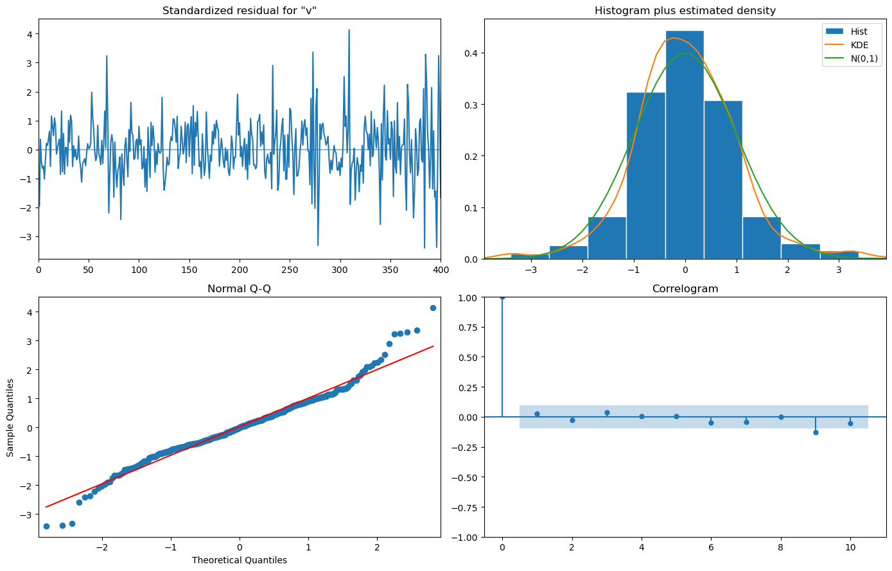

- **Autocorrelação:** correlograma dentro das bandas; Ljung-Box **não rejeita** → curto prazo
  bem modelado (**vale para as duas séries**).
- **Ressalvas (idem qtd):** **heterocedasticidade** e **caudas pesadas/assimetria** (Jarque-Bera
  significativo) — erros maiores nos dias atípicos. Justifica a intervenção como tratamento.

---

## Valor — previsto × realizado (SARIMAX)

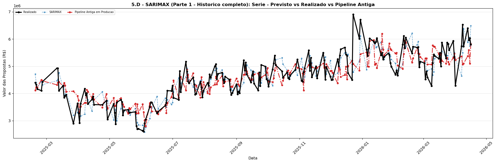

O SARIMAX acompanha bem nível e sazonalidade; os maiores erros concentram-se nos *saltos*
pós-atípicos (onde a Antiga também erra). A curva da quantidade (SARIMA) tem comportamento
análogo.

---

<!-- _class: section-divider -->

## Bloco 4 — Modelos mensais

### O total do mês, além do diário

---

## Modelos mensais — o método

Além do diário, acompanhamos o **total do mês** de cada série via **Nowcast**: realizado
acumulado no mês + previsão SARIMAX dos dias úteis restantes → atualiza a estimativa do total
dia a dia. As exógenas D-1 não entram na previsão dos dias restantes (não são conhecidas no
horizonte); a ordem sazonal (`m=5`) já captura o padrão semanal.

> **Objetivo:** acompanhar o total do mês em tempo real e caracterizar **a velocidade de
> convergência** do erro conforme o mês avança — quantos dias úteis são necessários até o
> nowcast ficar confiável.

---

## Resultado — Nowcast

O nowcast **converge para o realizado** conforme o mês avança (mais dias viram realizado,
menos ficam a cargo da previsão):

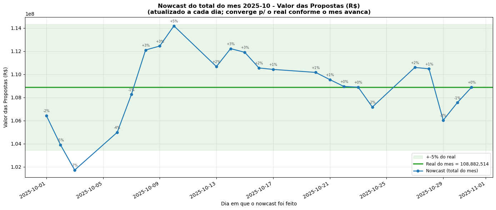

---

## Resultado — velocidade de convergência do erro

Trajetória **mediana** do `|Erro %|` do nowcast por dia útil do mês, agregando os **19 meses
completos** disponíveis (faixa = intervalo interquartil 25–75% entre os meses):

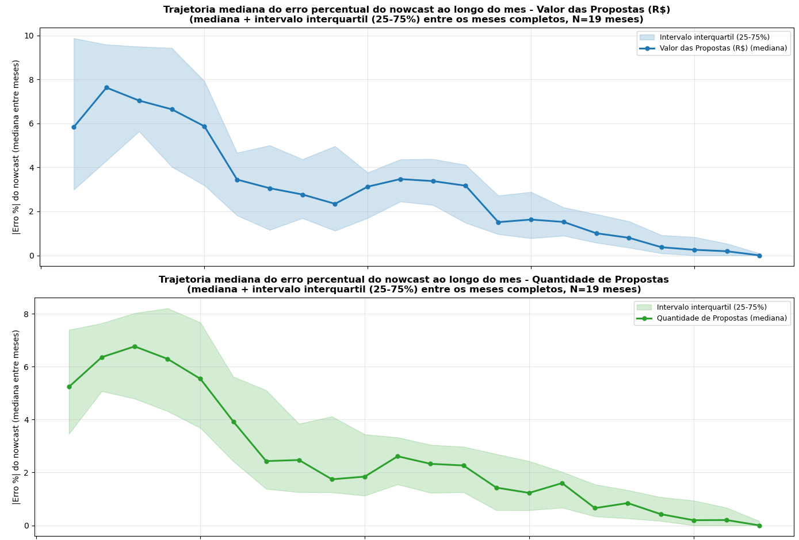

> **Achado:** o erro típico começa em ~5–7% nos primeiros dias do mês e cai para **< 2%** a
> partir de ~2/3 do mês corrido — o nowcast já é uma referência confiável bem antes do
> fechamento do mês, com trajetórias muito parecidas entre valor e quantidade.

---

<!-- _class: section-divider -->

## Interpretação, Conclusão e Discussão

### Fechamento do estudo

---

## Interpretação

**O que os modelos revelam, com significância estatística:**

1. **Valor é *puxado* pela fila.** `fila_d1` é *driver* positivo e forte (+R$ 96,8 mil por
   desvio-padrão de fila, p < 0,001): a fila de pagamento de ontem antecipa o valor de hoje.
2. **Quantidade é *autossuficiente*.** O valor de ontem não informa a quantidade de hoje
   (p = 0,61); o que a governa é a **estrutura própria** (MA(1) + sazonalidade semanal).
3. **Dias de erro operacional têm efeito real e mensurável** (véspera −R$ 2,0 mi / −922
   propostas; Microsoft −R$ 2,8 mi / −1.413) → merecem **intervenção**, não descarte cego.
4. **Ambas as dinâmicas diárias** são bem descritas por **suavização MA(1)** (−0,78/−0,79) com
   leve componente semanal.
5. **Valor e quantidade NÃO compartilham equilíbrio de longo prazo** → modelagem separada é a
   escolha correta (ticket médio não-estacionário).

---

## Conclusão

> **Valor → SARIMAX `(0,1,1)(0,0,1,5)` + `fila_d1` + intervenção.**
> Melhor **RMSPE (9,21%)** e **R² (0,753)** do estudo; MAPE praticamente empatado com a
> Pipeline Antiga, com a vantagem decisiva de ser **interpretável**.

> **Quantidade → SARIMA univariado `(0,1,1)(0,0,2,5)` + intervenção.**
> A exógena não ajuda; o modelo univariado com sazonalidade semanal é o **melhor e o mais
> parcimonioso** (MAPE 7,20%, RMSPE 9,08%, R² 0,414) — e supera a Antiga em todas as métricas.

- Modelos **brancos** competitivos com o melhor ML e **superiores no RMSPE** nas duas séries.
- A **análise de intervenção** melhora o ajuste (AIC↓, Ljung-Box deixa de rejeitar) em ambas.
- **Sem cointegração** valor × qtd → séries modeladas separadamente.
- Resposta à motivação inicial: **sim** — um modelo branco, com especificação única, **iguala
  ou supera** a pipeline em produção nas duas séries, sem abrir mão de interpretabilidade.

---

## Discussão — limitações e próximos passos

**Limitações**
- **Ajuste de intervenção da cointegração usava 1 único dummy pooled** (mesmo coeficiente para
  os 37 dias atípicos, sem distinguir Natal/Ano Novo/Carnaval) e só marcava o dia exato da
  véspera — dias de recesso adjacentes (26, 29, 30/dez) ficavam de fora, deixando alguns dias
  "não corrigidos" no gráfico de níveis padronizados (ex.: 31/dez/2025, z ≈ −4). **Já corrigido
  no código:** dummy próprio por tipo de véspera + dummy obrigatório para o dia útil anterior
  (rush pré-feriado); pendente apenas reexecutar o notebook para atualizar números/figuras.
- **Heterocedasticidade e caudas pesadas** nos resíduos das duas séries (mitigadas por
  intervenção, mas presentes) → intervalos de confiança otimistas nos extremos.
- **Classificação da forma** da intervenção (abrupto × gradual) tem pequeno *look-ahead*
  estrutural: é feita uma vez na série inteira (a maior parte é **calendário**, conhecido de
  antemão); os **coeficientes**, porém, são reestimados a cada dia no walk-forward.
- O **nowcast** do total mensal converge rápido (erro típico < 2% já em ~2/3 do mês corrido),
  mas ainda não foi comparado contra baselines simples (ex.: persistência do mês anterior) —
  fica como próximo passo antes de recomendar substituição de qualquer acompanhamento existente.

**Próximos passos**
- **ARDL bounds test** como *follow-up* formal da cointegração (ordens mistas I(0)/I(1)).
- Injetar intervenções (Carnaval/vésperas) como **exógena futura determinística** no nowcast.
- Avaliar **reclassificação da intervenção dentro do walk-forward** (rigor total).

---

## Referências

- Notebook do experimento: [[experimento_sarimax]]
- Justificativa detalhada: `docs/justificativa_sarimax_valor.md`
- Scripts de produção: `scripts/producao/projecoes_valor.py`, `projecoes_qtd.py`
- Backups de previsão: `resultados/backup_valor.xlsx`, `backup_qtd.xlsx`
